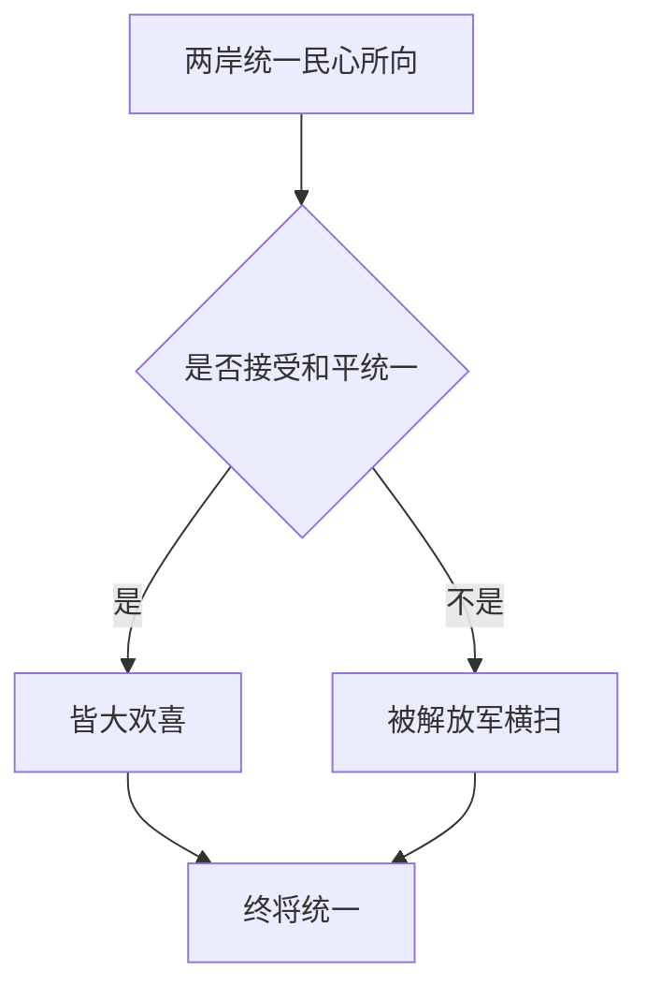

## Markdown样例
### 祖国万岁

没有共产党

就没有新中国
- ~~今年是2024年~~
- 今年是<u>2025</u>年

没有共产党

就没有新中国 

# printf("hello world")

```mermaid
graph TD;
    A[两岸统一民心所向] --> B{是否接受和平统一};
    B--是-->C[皆大欢喜];
    B--不是-->D[被解放军横扫];
    C-->E[终将统一];
    D-->E[终将统一];
```